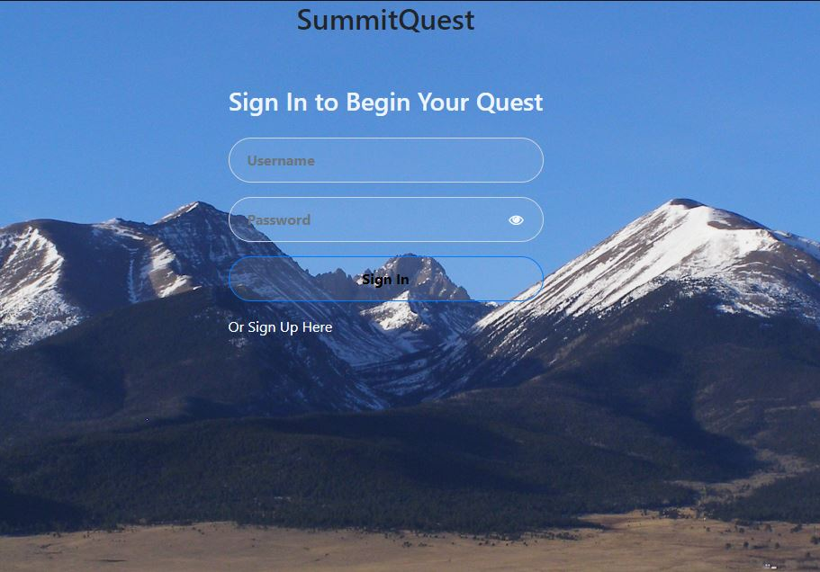

# SummitQuest

## Description

A site to track and log your progress of climbing Colorado 14ers! The site allows you to add peaks to your queue, and added completed quests with space to journal your experience.

On the dashboard you can find a list of all 58 of the state's 14ers along with info about them including elevation, difficulty, and if any special permits are required.

## Screenshot

;

## Credits

> Backend Development: Aaron Lyman and Daniel Goss

> Frontend Development: Chance Creger and Gabe Latimer

## Links

Github Repo: https://github.com/gabelats/SummitQuest

Deployed site:
